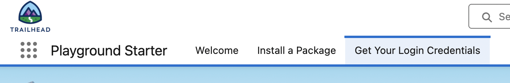
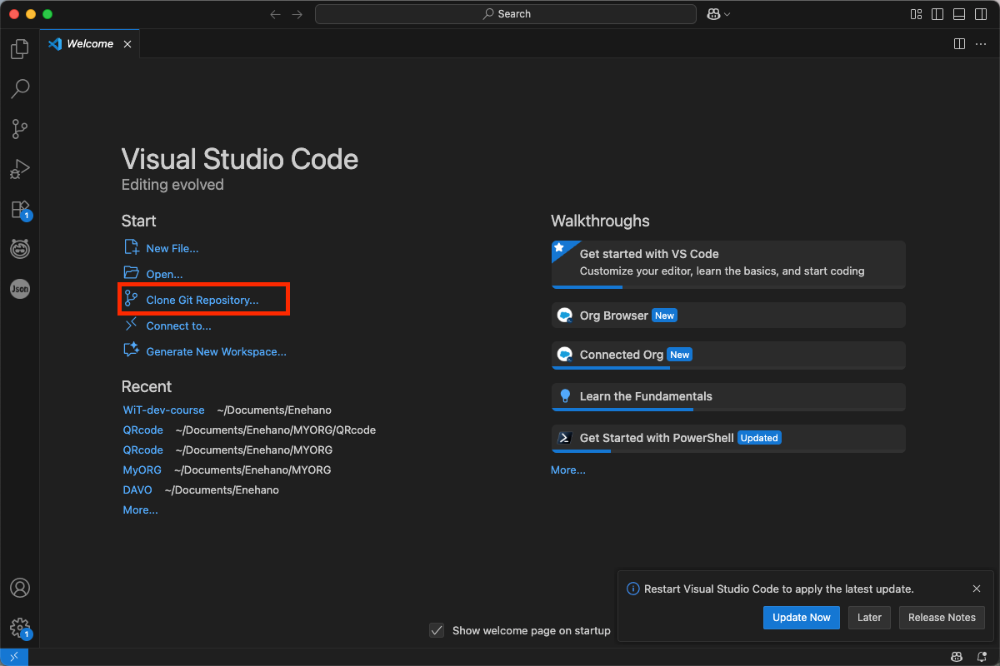
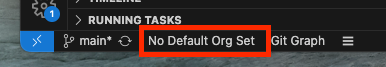

# Women in Tech developer kurz

community event [zde](https://trailblazercommunitygroups.com/events/details/salesforce-salesforce-women-in-tech-group-prague-czechia-presents-poznej-vyvoj-na-platforme-salesforce/)

Na kurzu projdeme jednotlivé tématické bloky stylem 15-30-15
- 15 minut teorie (základní orientace v tématu, na co se soustředit, zadání)
- 30 minut samostatná práce (prostor pro samostatnou/týmovou práci, budeme asistovat, použití ai doporučeno)
- 15 minut review (projdeme jednotlivá řešení, trochu je rozebereme a vylepšíme - jestli to vůbec půjde 🙂)

## Tématické bloky

🔧 1. Úvod do Salesforce platformy  
🏗️ 2. Vývojové nástroje a prostředí  
📊 4. Data model a práce s daty  
🧑‍💻 3. Apex - 1.0 synchronní  
🌐 6. Lightning Platform & UI vývoj - deklarativní  
🌐 6. Lightning Platform & UI vývoj - programovací  
🔄 5. Automatizace bez kódu (pro kontext) - record trigger (místo apexu)  
🔄 5. Automatizace bez kódu (pro kontext) - screen flow (místo LWC)  
🔗 7. Integrace - ze SF  
🔗 7. Integrace - do SF  
🛡️ 8. Bezpečnost a přístupová práva  
🧑‍💻 3. Apex - 2.0 asynchronní  
🧪 9. Testování  
🚀 10. Deployment a správa verzí  

## Příprava
abychom byli efektivní tak vás prosíme o přípravu prostředí abychom mohli začít a nezdržovali se setupem.

1. Trailhead Account
   - pokud máš, tak se přihlaš a přejdi na další bod
   - pokud ne, tak si založ zde [https://trailhead.salesforce.com](https://trailhead.salesforce.com)
   - Zvolte přihlášení přes Email (ikonka pošty), napište svoji emailovou adresu a potvrďte tlačítkem `Sign Up`.
   - Zadejte číselný kód, který vám přišel na email a potvrďte.
   - Vyplníte osobní údaje:  
     Profile URL ve tvaru - jmeno_prijmeni  
     Company Name - Women In Tech  
     Role Name - Student  
     Relationship to Salesforce - Non-Customer/Prospect  
   - Potvrďte odeslání formuláře a účet máte založený.

2. Dev Org - vaše osobní salesforce vývojové prostředí
   - jdi na stránku [https://trailhead.salesforce.com/users/profiles/orgs](https://trailhead.salesforce.com/users/profiles/orgs)
   - Jeden org je již defaultně založený, můžete si jej přejmenovat nebo založit nový přes tlačítko `Create Playground`
   - Poté si vámi vybraný org otvorte pomocí tlačidla `Launch`. Po otevření budete mít medzi SF tabami možnost `Get Your Login Credentials`.
   

   - Poté klikněte na tlačítko `Reset Your Password`.
   

   - Do emailu vám přijde odkaz k vytvoření nového hesla. Změňte si ho a spolu s username zapamatujte.
  
3. IDE - aplikace pro psaní kódu
   - budeme pracovat ve Visual Studio Code (VSC)  doporučujeme stáhnout a na kurzu používat ten [https://code.visualstudio.com](https://code.visualstudio.com) (ostatní idečka neznáme, takže v případě problému nejspíše nebudeme vědět)
   - Je potrebné si také stáhnout a nainstalovat SF Cli, který umožňuje práci se salesforce metadatama. Odkaz na tool [https://developer.salesforce.com/tools/salesforcecli](https://developer.salesforce.com/tools/salesforcecli).
   - Otevřete VSC a v levém banneru klikněte na ikonku s helptextem `Extensions`. Zadejte text `Salesforce Extension Pack` a nainstalujte
   - naklonujte si tento repositář File -> new window -> ikona gitu v levém panelu -> tlačítko Clone Git Repository -> vložit link na repo (https://github.com/maratyrlik/WiT-dev-course.git) -> ENTER
   

4. Propojení vašeho Orgu s VS Code
   - Na spodní lište kliknete na No Default Org Set. V horní lište se zobrazí možnosti. Kliknete na `SFDX: Authorize an Org` a poté na `Sandbox`.Otevře se vám okno v prohlížeči se stránkou pro přihlášení na Org. Do první kolonky vložte svůj username, který jste si zapsali bokem a heslo, které jste si nastavovali přes odkaz z mailu a potvrďte tlačítkem `Log In`.
   

   - Možná se vám zobrazí ještě stránka s tabulkou, textem a dvěma tlačítky, klikněte na Allow. Poté můžete prohlížeč zavřít.

pokud si nebudete vědět rady klidně napište na mail nebo teams marek.tyrlik@enehano.cz (na subject: "WiT kurz" mi pípne notifikace 🙂)

Těšíme se na společný salesforce víkend 🙂
